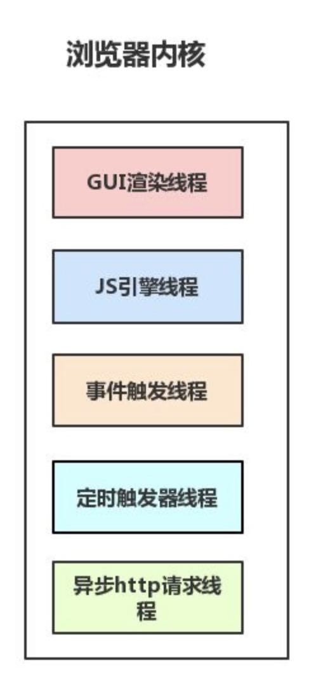

# 输入URL到页面加载的过程

[[TOC]]

## 流程
```js
从浏览器接收url到开启网络请求线程 →→→ 开启网络线程到发出一个完整的http请求  →→→  服务器接收到请求到对应后台接收到请求
 →→→ 后台和前台的http交互 →→→ 单独拎出来的缓存问题，http的缓存 →→→ 解析页面流程 →→→ CSS的可视化格式模型  →→→ 
JS引擎解析过程
```

## 梳理主干流程
```js
1. 从浏览器接收url到开启网络请求线程（这一部分可以展开浏览器的机制以及进程与线程之间的关系）

2. 开启网络线程到发出一个完整的http请求（这一部分涉及到dns查询，tcp/ip请求，五层因特网协议栈等知识）

3. 从服务器接收到请求到对应后台接收到请求（这一部分可能涉及到负载均衡，安全拦截以及后台内部的处理等等）

4. 后台和前台的http交互（这一部分包括http头部、响应码、报文结构、cookie等知识，可以提下静态资源的cookie优化，以及编码解码，如gzip压缩等）

5. 单独拎出来的缓存问题，http的缓存（这部分包括http缓存头部，etag，catch-control等）

6. 浏览器接收到http数据包后的解析流程（解析html-词法分析然后解析成dom树、解析css生成css规则树、合并成render树，然后layout、painting渲染、复合图层的合成、GPU绘制、外链资源的处理、loaded和domcontentloaded等）

7. CSS的可视化格式模型（元素的渲染规则，如包含块，控制框，BFC，IFC等概念）

8. JS引擎解析过程（JS的解释阶段，预处理阶段，执行阶段生成执行上下文，VO，作用域链、回收机制等等）

9. 其它（可以拓展不同的知识模块，如跨域，web安全，hybrid模式等等内容）
```

## 1.从浏览器接收url到开启网络请求线程
```js
浏览器进程/线程模型，JS的运行机制

多进程的浏览器
浏览器是多进程的，有一个主控进程，以及每一个tab页面都会新开一个进程（某些情况下多个tab会合并进程）

进程可能包括主控进程，插件进程，GPU，tab页（浏览器内核）等等

Browser进程：浏览器的主进程（负责协调、主控），只有一个
第三方插件进程：每种类型的插件对应一个进程，仅当使用该插件时才创建
GPU进程：最多一个，用于3D绘制
浏览器渲染进程（内核）：默认每个Tab页面一个进程，互不影响，控制页面渲染，脚本执行，事件处理等（有时候会优化，如多个空白tab会合并成一个进程）
```

<!--   -->

```js
解析URL  →→→ 开启网络线程到发出一个完整的http请求（DNS查询得到IP ，tcp/ip请求 ，再到网络层的ip寻址，
再到数据链路层的封装成帧，最后到物理层的利用物理介质传输）


输入URL后，会进行解析（URL的本质就是统一资源定位符）

URL一般包括几大部分：
protocol，协议头，譬如有http，ftp等
host，主机域名或IP地址
port，端口号
path，目录路径
query，即查询参数
fragment，即#后的hash值，一般用来定位到某个位置

主要内容包括：dns查询，tcp/ip请求构建，五层因特网协议栈等等

DNS查询得到IP
如果输入的是域名，需要进行dns解析成IP，大致流程：

如果浏览器有缓存，直接使用浏览器缓存，否则使用本机缓存，再没有的话就是用host
如果本地没有，就向dns域名服务器查询（当然，中间可能还会经过路由，也有缓存等），查询到对应的IP
注意，域名查询时有可能是经过了CDN调度器的（如果有cdn存储功能的话）
而且，需要知道dns解析是很耗时的，因此如果解析域名过多，会让首屏加载变得过慢，可以考虑dns-prefetch优化

tcp/ip请求
http的本质就是tcp/ip请求
3次握手规则建立连接以及断开连接时的四次挥手

```

# 2.服务器接收到请求到对应后台接收到请求
```js
服务端在接收到请求时，内部会进行很多的处理

负载均衡
对于大型的项目，由于并发访问量很大，所以往往一台服务器是吃不消的，所以一般会有若干台服务器组成一个集群，然后配合反向代理实现负载均衡

(用户发起的请求都指向调度服务器（反向代理服务器，譬如安装了nginx控制负载均衡），然后调度服务器根据实际的调度算法，
分配不同的请求给对应集群中的服务器执行，然后调度器等待实际服务器的HTTP响应，并将它反馈给用户)

后台的处理
一般有的后端是有统一的验证的，如安全拦截，跨域验证
如果这一步不符合规则，就直接返回了相应的http报文（如拒绝请求等）
然后当验证通过后，才会进入实际的后台代码，此时是程序接收到请求，然后执行（譬如查询数据库，大量计算等等）
等程序执行完毕后，就会返回一个http响应包（一般这一步也会经过多层封装）
然后就是将这个包从后端发送到前端，完成交互

后台和前台的http交互
前后端交互时，http报文作为信息的载体

http报文结构
报文一般包括了：通用头部，请求/响应头部，请求/响应体

1xx——指示信息，表示请求已接收，继续处理
2xx——成功，表示请求已被成功接收、理解、接受
3xx——重定向，要完成请求必须进行更进一步的操作
4xx——客户端错误，请求有语法错误或请求无法实现
5xx——服务器端错误，服务器未能实现合法的请求

请求/响应头部
Accept: 接收类型，表示浏览器支持的MIME类型 （对标服务端返回的Content-Type）
Accept-Encoding：浏览器支持的压缩类型,如gzip等,超出类型不能接收
Content-Type：客户端发送出去实体内容的类型
Cache-Control: 指定请求和响应遵循的缓存机制，如no-cache
If-Modified-Since：对应服务端的Last-Modified，用来匹配看文件是否变动，只能精确到1s之内，http1.0中
Expires：缓存控制，在这个时间内不会请求，直接使用缓存，http1.0，而且是服务端时间
Max-age：代表资源在本地缓存多少秒，有效时间内不会请求，而是使用缓存，http1.1中
If-None-Match：对应服务端的ETag，用来匹配文件内容是否改变（非常精确），http1.1中
Cookie: 有cookie并且同域访问时会自动带上
Connection: 当浏览器与服务器通信时对于长连接如何进行处理,如keep-alive
Host：请求的服务器URL
Origin：最初的请求是从哪里发起的（只会精确到端口）,Origin比Referer更尊重隐私
Referer：该页面的来源URL(适用于所有类型的请求，会精确到详细页面地址，csrf拦截常用到这个字段)
User-Agent：用户客户端的一些必要信息，如UA头部等

常用的响应头部（部分）
Access-Control-Allow-Headers: 服务器端允许的请求Headers
Access-Control-Allow-Methods: 服务器端允许的请求方法
Access-Control-Allow-Origin: 服务器端允许的请求Origin头部（譬如为*）
Content-Type：服务端返回的实体内容的类型
Date：数据从服务器发送的时间
Cache-Control：告诉浏览器或其他客户，什么环境可以安全的缓存文档
Last-Modified：请求资源的最后修改时间
Expires：应该在什么时候认为文档已经过期,从而不再缓存它
Max-age：客户端的本地资源应该缓存多少秒，开启了Cache-Control后有效
ETag：请求变量的实体标签的当前值
Set-Cookie：设置和页面关联的cookie，服务器通过这个头部把cookie传给客户端
Keep-Alive：如果客户端有keep-alive，服务端也会有响应（如timeout=38）
Server：服务器的一些相关信息

（请求头部和响应头部是匹配分析的。）
譬如，请求头部的Accept要和响应头部的Content-Type匹配，否则会报错
譬如，跨域请求时，请求头部的Origin要匹配响应头部的Access-Control-Allow-Origin，否则会报跨域错误
```
 


## 3.浏览器内核拿到内容后，渲染步骤大致
```js
1. 解析HTML，构建DOM树
2. 解析CSS，生成CSS规则树
3. 合并DOM树和CSS规则，生成render树
4. 布局render树（Layout/reflow），负责各元素尺寸、位置的计算
5. 绘制render树（paint），绘制页面像素信息
6. 浏览器会将各层的信息发送给GPU，GPU会将各层合成（composite），显示在屏幕上
```
 

```js

```